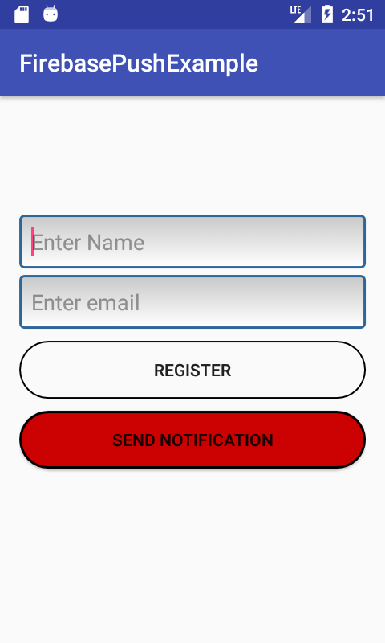
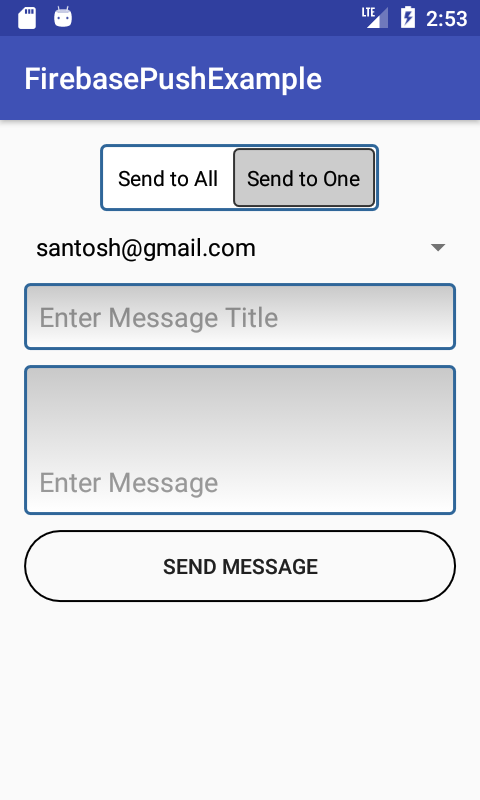
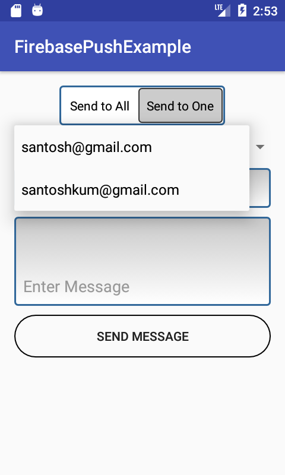
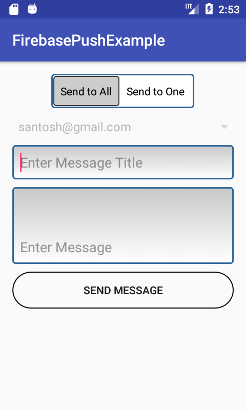
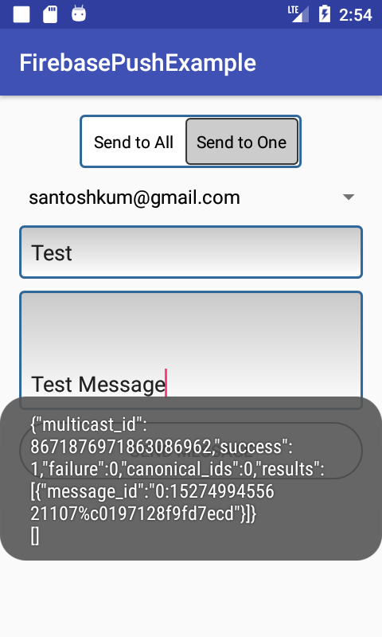
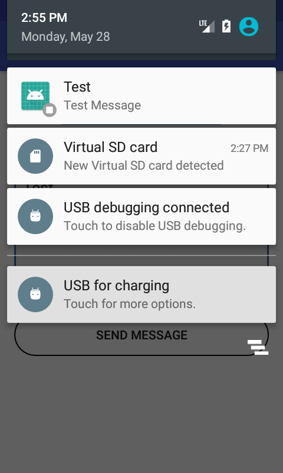

# Firebase Notification With PHP and Mysql
  
A simple Android app. send notification from your mobile  to other mobile(s).

# Features
Allows you to send, recive and view notification through firebase and php  

# TO-DO
Improve the UI  
General QOL changes

# Acknowledgements

[Volly]( compile 'com.android.volley:volley:1.0.0').

